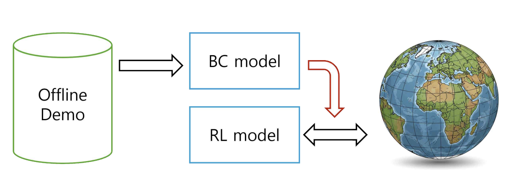

# SKKU Graduate Project BC2RL

Behavior Cloning to Reinforcement Learning method

---
# Key Environment Setting
```
* Ubuntu 20.04+
* python 3.10
* torch 2.8.0
* Maniskill 3.0.0
```

---
# Installation
For the Maniskill Environments follow the [official documents](https://maniskill.readthedocs.io/en/latest/#)

If you can run ``` ./testing/test.py ```, you can run the experiments

---
# Maniskill tasks
```
* pick cube
* push T
* stack cube
```

for more dataset you can check in [here](https://maniskill.readthedocs.io/en/latest/tasks/index.html)

---
# Usage
use bash files to experiments

```
bc_train: default bc training 
rl_train: default rl training (ppo)
bc2rl_state/rgbd: bc2rl training (rl with regularization term)
bc2rl_hybrid_sampling: bc2rl training (rl with bc sampling)
```
 